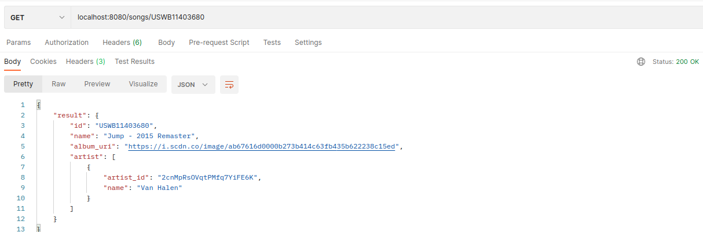

# UMG Media Group Test #


Go application that exposes a REST API for managing and retrieving music songs. It utilizes the Gin framework for routing and handling HTTP requests, and relies on several external packages for configuration, database management, and interacting with the Spotify API.

## Running the server ##

Before running the Gin server, you need to set up a PostgreSQL database. You can go to the `integration` directory and run `docker-compose up` to easily create and manage the database container.

You must also have spotify developer credentials set up as environment variables.

shell
```
export SPOTIFY_CLIENT_ID="<client_id>"
export SPOTIFY_CLIENT_SECRET="<client_secret>"
```

You can then run `go run .` from the root directory to start the gin server.

## Screenshots ##
Please find screenshots in the `screenshots` directory that show the server in working order.

for example: for getting song by ISRC, see the following:


## Securing the Server ##
In response to the authentication question, this would be done quite easily with Gin middleware, that could intercept each http request before it got to the main routing handler, and return unauthenticated requests. This could be used with any Oauth2 API, and we could forward the request on to them to check the validity of the token. Upon healthy token or token that needs refreshing, we could then proceed with the servicing of that HTTP request. This would result in a clean encapsulated authentication that is separate to the main business logic.

## Notes ##
- Logging has not been strongly focused on as this is a test. But you can assume that in production, in places where an error value is checked or bubbled up, we would place a logging statement for observability.
- The ISRC has been assumed to be the desired primary key, even though there esists an ID returned by the API for each FullTrack.
